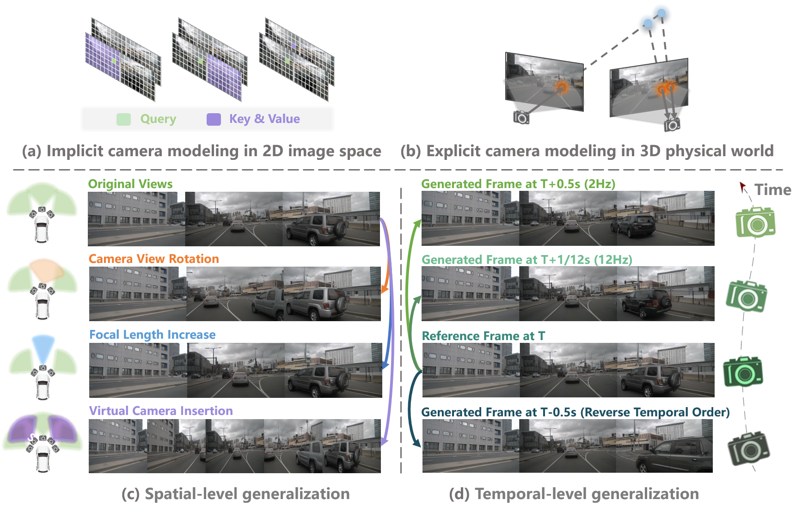
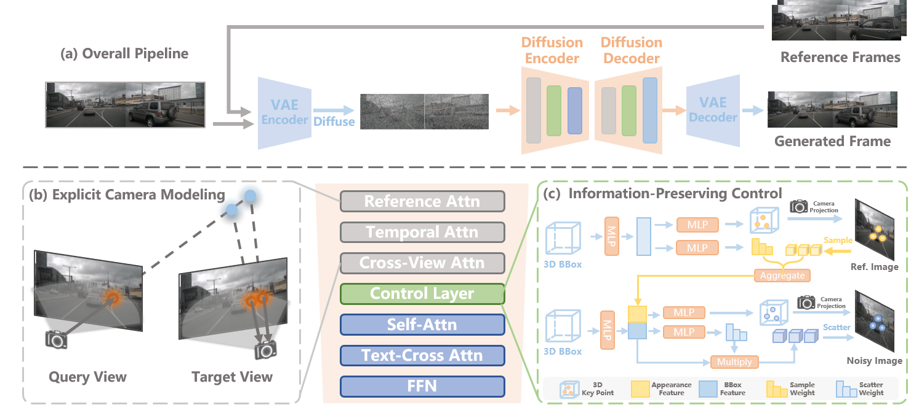

# DriveCamSim: Generalizable Camera Simulation via Explicit Camera Modeling for Autonomous Driving

## News
* **`27 May, 2025`:** We release the DriveCamSim paper on [arXiv](). Code & Models will be released after preparation. Please stay tuned!

## Introduction
> DriveCamSim is a generation framework for generalizable camera simulation. With proposed Explicit Camera Modeling and Information-Preserving control mechanism, DriveCamSim not only achieves SOTA performance in visual quality and controllability, but also unleashes the generalization capability across spatial-level(camera extrinsic/intrinsic, number of views) and temporal-level(video frequency, reverse temporal order), supporting flexible camera simulation for downstream application.
- 

    
     
    
Instead of (a) implicit camera modeling in 2D image space, we propose (b) explicit camera modeling in 3D physical world to unleash the (c) spatial-level and (d) temporal-level generalization capabilities for flexible camera simulation.

    
     
    
Overall framework of DriveCamSim.

